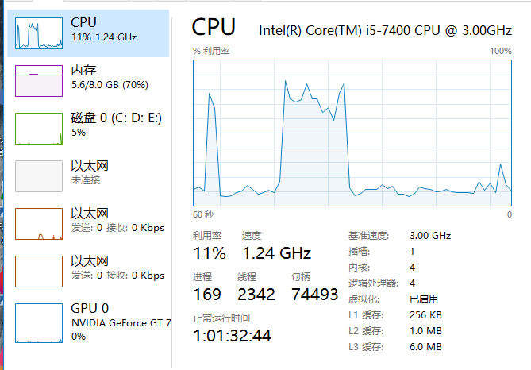

# melody-grpc
RPC(远程过程调用) 的架构最常见的是“动态代理”方式，事先定义好接口，用一个代理假装实现了这个接口（真正的实现放在服务端），供客户端调用，
代理内部将该方法调用封装成一个网络请求送到服务端。服务端根据参数找到对应的注册好的对象处理，返回给客户端
## proto
```proto
syntax = "proto3";
package accountService;
option java_package = "com.melody.proto.grpc.qryaccount";
option java_outer_classname = "QryAccountProto";

//账户查询请求
message AccountQryRequest {
    //请求流水
    string requestId = 1;
    //用户ID
    string userId = 2;
}

//账户查询响应
message AccountQryResponse {
    //请求流水
    string requestId = 1;
    //返回码，1:成功; -1:失败
    int32 rc = 2;
    //错误消息
    string msg = 3;
    //账户余额
    int32 amount = 4;
}

/**
 * 账户操查询服务
 */
service QryAccountService {

    //账户查询方法
    rpc QryAccount(AccountQryRequest) returns (AccountQryResponse);
}
```
mvn clean compile打包使用就可以。
如何生成javas代码,使用如下代码:
```
protoc  --java_out=./src   ./proto/msg.proto
```
生成的文件在target目录中

## server端


## client端

### 同步阻塞调用

#### 2. 性能分析
1. 客户端循环发1w次



2. 客户端使用线程池并发发送发1w次


### 异步回调

### 同步非阻塞

